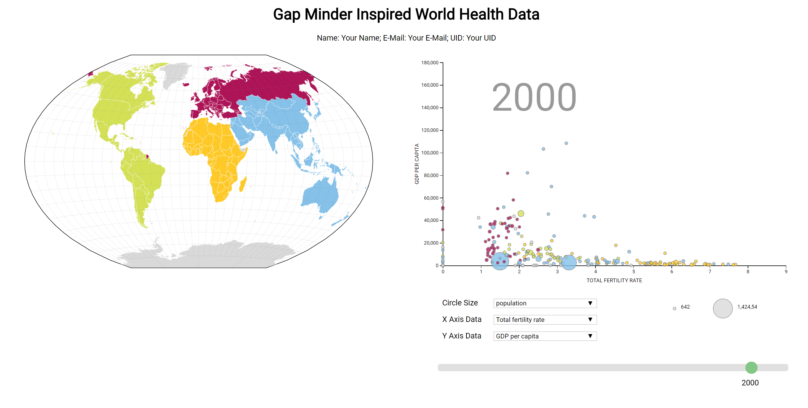

A visualization inspired by [Gapminder](https://www.gapminder.org/) to display world health data. The visualization is made up of three views: the map, the scatterplot, and the info box. 

The **map** provides geospatial context. Countries are color-coded by region and can be selected. 

The **scatterplot** is also color-coded by region, with selectable country bubbles. The data shown along the scatterplot axes are chosen from two drop-down menus. A third drop-down allows the user to choose the data that maps to the size of the bubbles. Below the drop-down menus is a range slider that changes the data to reflect a specified year. 

The **info box** shows basic information about the selected country.

When a country is selected in either the map or the scatterplot, the country is highlighted in both views and the info box will show data about that country. The final visualization should look similar to the figure below:

## Learning Goals

The learning goals for this homework are the following: 

 * Working with scales. 
 * Working with maps.
 * Dynamically updating charts.
 * Developing a visualization with multiple views that synchronizes selections.
  
## Project Structure

The project file structure looks like this:

    hw4.html
    hw4.md
    style.css
    data/
        cmu5.csv
        gdppc.csv
        loife_expect.csv
        pop.csv
        tfr.csv
        world.json
    js/
        gap_plot.js
        info_box.js
        map.js        
        script.js

## Running the Project

To access the data files with javascript, you will need to be *serving* the homework directory, not just opening the HTML file in a browser. If your development environment doesn't already launch a server for you, you can start one with:

    $ cd path/to/hw4

    # For Python 2:
    $ python -m SimpleHTTPServer

    # For Python 3:
    $ python -m http.server

You can view the page at [http://localhost:8080](http://localhost:8080).